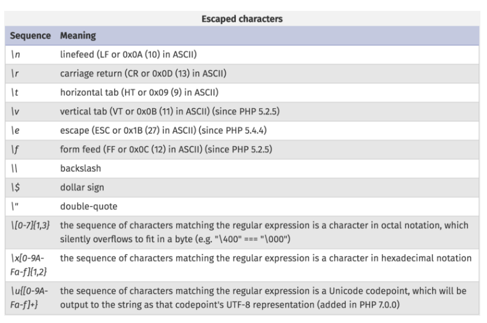
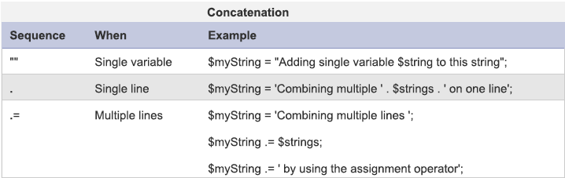
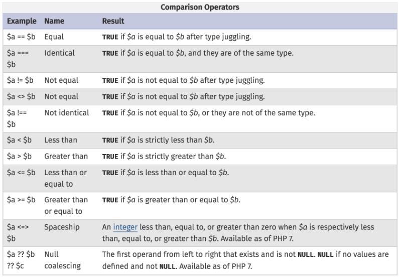

Intro to PHP
============

PHP is commonly used by people who want to build a simple, dynamic website quickly and effortlessly. PHP basic be led through a series of Courses and Workshops so one can efficiently master the skills you need achieve your goals.

About PHP Basic
---------------

This course will go over the basics of the language, ranging from basic statements to conditionals. This course will create a simple "Unit Converter" as well as a "Daily Exercise Program". Then finish up by combining those programs with HTML to create a personal webpage to demonstrate PHP skills.

Will learn
---------
- Variables
- Operators
- Conditionals
- Comments
- PHP on the Web

Note
----

